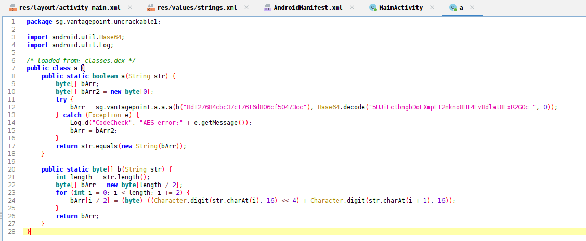
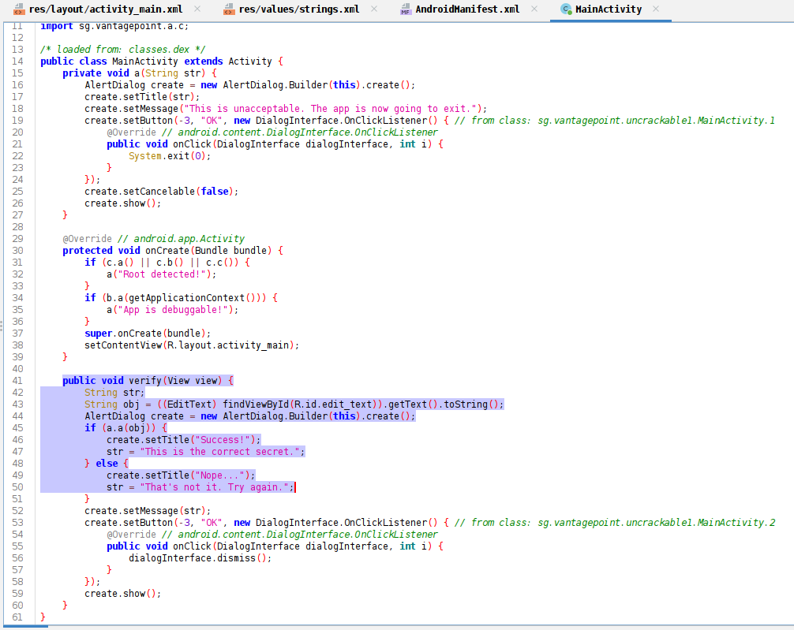
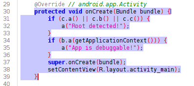
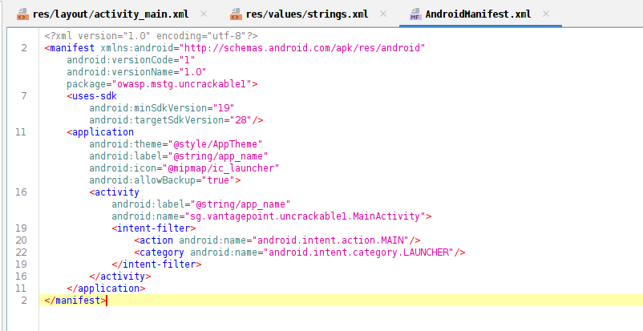
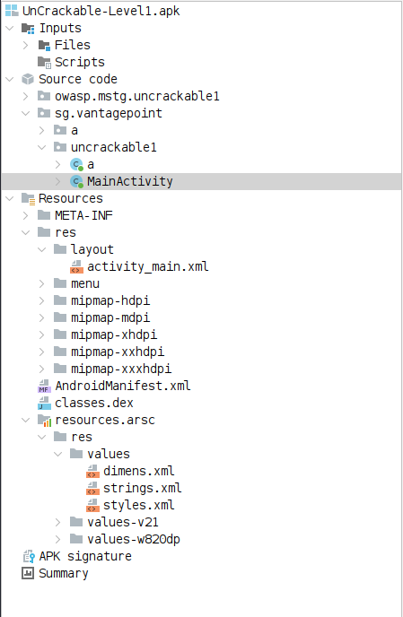
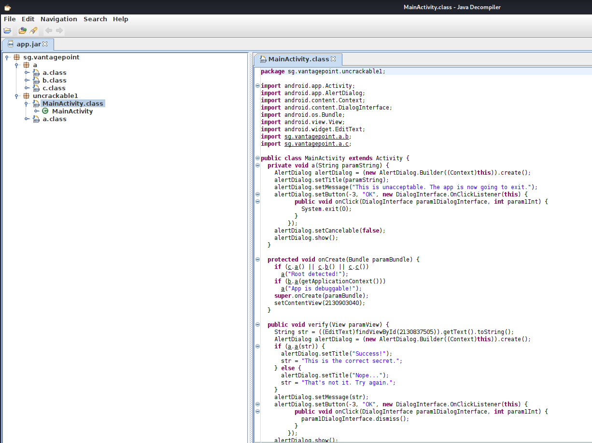

# Rapport d'analyse statique - UnCrackable Level 1

## Informations générales

- **Titre :** Analyse statique de UnCrackable Level 1
- **Date de l'analyse :** 24/04/2026
- **Analyste :** CHARRAJ Mouad
- **APK :** `UnCrackable-Level1.apk`, version `1.0`
- **Package :** `owasp.mstg.uncrackable1`
- **Provenance :** Application d'entraînement OWASP MSTG / UnCrackable Level 1
- **Outils utilisés :** JADX GUI (version non précisée), dex2jar v2.1-SNAPSHOT, JD-GUI (version non précisée)

## Résumé exécutif

Cette analyse statique a révélé **4 vulnérabilités ou faiblesses potentielles** dans l'application **UnCrackable Level 1**.

Les principales préoccupations concernent l'exposition d'éléments sensibles dans l'APK, la vérification du secret réalisée côté client, ainsi que des mécanismes de protection présents mais contournables.

Le niveau de risque global est évalué comme **élevé**, car la logique de validation peut être comprise après décompilation et plusieurs informations exploitables restent accessibles dans le code.

**Actions prioritaires recommandées :**
1. Retirer toute clé, secret et donnée sensible du code client.
2. Déporter la vérification du secret vers un backend ou un service distant maîtrisé.
3. Désactiver `android:allowBackup` si non nécessaire et renforcer la configuration de build de production.

## Constats détaillés

### Constat #1 : Clé et donnée chiffrée stockées en dur

**Sévérité :** Élevée  
**Description :** La logique de validation contient une clé AES hexadécimale et une chaîne Base64 directement intégrées au code de l'application.  
**Localisation :** `sg.vantagepoint.uncrackable1.a`, méthode `a(String)`  
**Impact potentiel :** Un attaquant peut extraire ces valeurs, reproduire le déchiffrement et retrouver le secret attendu sans avoir à deviner la logique métier.  
**Remédiation recommandée :** Ne jamais embarquer de clé ni de secret dans l'APK. Les opérations sensibles doivent être déplacées côté serveur.  

  
   <em>Figure 1 - Clé AES et donnée encodée visibles dans le code décompilé.</em>

### Constat #2 : Vérification du secret réalisée localement

**Sévérité :** Élevée  
**Description :** La méthode `verify(View view)` lit la saisie utilisateur puis appelle une comparaison locale pour déterminer si la réponse est correcte.  
**Localisation :** `sg.vantagepoint.uncrackable1.MainActivity`, méthode `verify(View view)`  
**Impact potentiel :** Cette logique peut être analysée, patchée ou contournée par rétro-ingénierie, ce qui réduit fortement la valeur de la protection.  
**Remédiation recommandée :** Déplacer la validation côté serveur. À défaut, renforcer l'application par obfuscation, contrôle d'intégrité et détection de modification.  

  
   <em>Figure 2 - Vérification du secret directement dans l'activité principale.</em>

### Constat #3 : Contrôles root et debug limités au client

**Sévérité :** Moyenne  
**Description :** Au démarrage, l'application vérifie la présence d'un appareil rooté et l'état de débogage avant d'autoriser l'exécution normale.  
**Localisation :** `sg.vantagepoint.uncrackable1.MainActivity`, méthode `onCreate(Bundle)`  
**Impact potentiel :** Ces mécanismes retardent l'analyse mais restent contournables par patching, hooking ou instrumentation dynamique.  
**Remédiation recommandée :** Conserver ces contrôles comme défenses complémentaires uniquement, et ne pas les considérer comme une protection suffisante à eux seuls.  

  
   <em>Figure 3 - Contrôles root et debug exécutés au lancement.</em>

### Constat #4 : Sauvegarde applicative autorisée

**Sévérité :** Moyenne  
**Description :** Le manifeste de l'application déclare `android:allowBackup="true"`.  
**Localisation :** `AndroidManifest.xml`, balise `<application>`  
**Impact potentiel :** Si l'application stocke des données localement, elles peuvent être récupérées via les mécanismes de sauvegarde de la plateforme.  
**Remédiation recommandée :** Définir `android:allowBackup="false"` si la sauvegarde n'est pas nécessaire, ou encadrer strictement les données autorisées en sauvegarde.  

  
   <em>Figure 4 - Attribut <code>allowBackup</code> et activité de lancement visibles dans le manifeste.</em>

## Annexes

### Permissions demandées

- Aucune permission explicite n'apparaît dans le manifeste visible dans les éléments fournis.

### Composants exportés

- `sg.vantagepoint.uncrackable1.MainActivity` : activité principale exposée comme point d'entrée via `MAIN` et `LAUNCHER`.

### Autres éléments pertinents

- **Empreinte SHA-256 de l'APK :** `1da8bf57d266109f9a07c01bf7111a1975ce01f190b9d914bcd3ae3dbef96f21`
- **Contenu observé dans l'APK :** `AndroidManifest.xml`, `classes.dex`, répertoire `res/`, fichiers de signature `META-INF/`
- **Chaîne d'analyse utilisée :** ouverture directe de l'APK dans JADX GUI, extraction de `classes.dex`, conversion en JAR avec dex2jar, relecture du code dans JD-GUI

### Démarche pour retrouver la chaîne cachée

La chaîne cachée, assimilable au "flag" dans ce contexte pédagogique, peut être retrouvée à partir du code statique en suivant la logique suivante :

1. Ouvrir `sg.vantagepoint.uncrackable1.MainActivity` et repérer que la méthode `verify(View view)` appelle la fonction `a.a(str)` pour valider l'entrée utilisateur.
2. Ouvrir ensuite la classe `sg.vantagepoint.uncrackable1.a`, méthode `a(String)`, afin d'identifier les éléments codés en dur utilisés dans la vérification.
3. Relever la clé hexadécimale et la chaîne encodée en Base64 visibles dans cette méthode.
4. Rejouer localement la routine de déchiffrement employée par l'application pour obtenir la valeur en clair.
5. Saisir la valeur déchiffrée dans le champ de l'application : si elle est correcte, l'application affiche `Success!`.

Pour l'échantillon standard **OWASP UnCrackable Level 1**, la chaîne obtenue est généralement : `I want to believe`.

Cette valeur doit toutefois être confirmée sur l'APK réellement analysé si celui-ci diffère de la version d'entraînement classique.

  
   <em>Figure 5 - Vue d'ensemble de l'APK dans JADX GUI.</em>

  
   <em>Figure 6 - Vérification complémentaire du code Java dans JD-GUI.</em>

